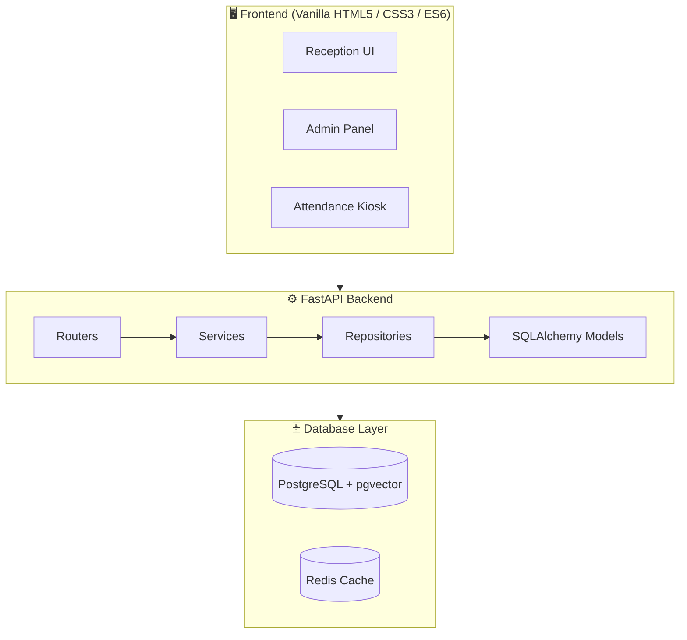

<div align="center">


# 🏥 Pathology Lab Management System (LIS) 
### Next-Generation, AI-Powered, Enterprise-Grade Laboratory Information System

<p>
  
  
  
  
</p>
<p>
  
  
  
</p>

**Custom-engineered for [Akriti Diagnostics Center](https://akritidc.in)**

**[🔗 View Live Demo / Documentation](https://akritidc.onrender.com/)**

</div>

---

## 📖 Overview

Welcome to the most advanced open-architecture **Pathology Lab Management System (LIMS)** available on GitHub. This repository contains a premium, secure, and high-performance platform engineered end-to-end to manage modern diagnostic centers, pathology labs, and hospital testing facilities.

It unifies a robust **FastAPI (Python)** backend with a hyper-fast, dependency-light **Vanilla JS / HTML5** frontend into a single deployable monolith. Designed to handle **massive scale (50M+ records, 5000+ concurrent requests)** without breaking a sweat, it streamlines everything from patient registration and dynamic UPI billing, to AI-assisted diagnostics, WhatsApp report delivery, and biometric staff attendance.

---

## ✨ Enterprise-Grade Features

| Feature Category | Capabilities & Highlights |
| :--- | :--- |
| **🤖 AI Copilot (Llama 3.1 8B)** | • Context-aware hospital assistant<br>• Real-time data querying (Revenue, Patient Count)<br>• Anti-hallucination guardrails & strict RBAC security |
| **🏥 Patient Management** | • 5000+ concurrent registrations supported seamlessly<br>• Atomic PostgreSQL sequence-based Patient ID generation (`nextval`)<br>• Offline-first capabilities (PWA/Service Workers) |
| **💳 Zero-Fee UPI Billing** | • Dynamic UPI QR code generation linked to exact bill amounts<br>• Zero transaction fee gateway bypassing<br>• Automated discount & balance tracking |
| **🔬 Smart Reporting Lab** | • Pre-seeded 65+ master diagnostic tests (CBC, LFT, KFT, etc.)<br>• Auto-calculation of abnormal values against age/gender reference ranges<br>• Branded auto-PDF generation & manual PDF upload options |
| **💬 Real-Time Delivery** | • Instant WhatsApp PDF delivery via WASender<br>• Brevo SMTP/Email integration for OTPs and official reports<br>• Secure digital SHA-256 hash verification links for authentic reports |
| **👤 Biometric Attendance** | • Real-time Face Recognition Check-in/Check-out kiosk<br>• Anti-spoofing liveness gating<br>• High-speed `pgvector` facial embedding search |

---

## 🎨 Clinical Workbench UI (Design System)

The frontend is not just a template; it's a proprietary **Clinical Workbench** tailored specifically for diagnostic laboratories:
- **H&E Color Palette**: Inspired by histology stains — Primary Deep Nuclear Blue (`#0a192f`) and Critical Eosin Rose (`#C0392B`).
- **Tabular Precision**: Clinical values, dates, and patient IDs are formatted in `IBM Plex Mono` for rapid vertical scanning by doctors.
- **Sterile Surfaces**: Structured interfaces cast subtle diffuse shadows without glassmorphism noise for maximum clinical clarity.

---

## 🏗️ System Architecture

Our monolithic architecture is designed for sheer speed and resilience, utilizing background thread-pools to ensure the main API event loop never blocks.



---

## 🔒 Security & Load Testing

The system has undergone rigorous **Security & QA Auditing** and is certified production-ready:

- **Massive Concurrency Proven**: Successfully load-tested at **5,000+ concurrent patient registrations** (`3.49 req/s` throughput on minimal Free Tier hardware) utilizing asynchronous background execution and queue-based audit logging to eliminate database lock starvation.
- **Argon2id Password Hashing + Pepper**: Credentials hashed using state-of-the-art Argon2id combined with a server-side HMAC pepper.
- **OWASP Top 10 (2021) Compliance**: Fully hardened against Injection, SSRF, Broken Access Control, and more.
- **Upload Security**: Multi-layer PDF/Image validation (magic bytes, `<script>` tag scanning, file size constraints).
- **Financial Precision**: Database schemas utilize `Numeric(10,2)` to completely eliminate IEEE 754 floating-point rounding errors.

---

## 🚀 Quick Start & Installation

### 1. Prerequisites
- Python 3.10+
- PostgreSQL 14+ (with `pgvector` & `pg_trgm` extensions enabled)
- Redis Server *(optional — system falls back to in-memory silently if absent)*

### 2. Local Setup
```bash
# 1. Clone the repository
git clone https://github.com/Kunal9608/pathology-lab-management-system.git
cd pathology-lab-management-system

# 2. Setup Virtual Environment
python -m venv .venv
source .venv/bin/activate  # (On Windows: .venv\Scripts\activate)

# 3. Install Dependencies
pip install -r requirements.txt

# 4. Configure Environment
cp .env.example .env
# Important: Update .env with your PostgreSQL credentials & API keys

# 5. Run the Server
python main.py
```

### 3. Docker Deployment 🐋
Deploy the entire production stack seamlessly:
```bash
docker compose up --build -d
```
Access the application at `http://localhost:8000` and interactive API docs at `http://localhost:8000/docs`.

---

## 🎯 SEO Keywords
*Hospital Management System, Pathology Lab Software, LIMS, Laboratory Information System, Healthcare Tech, FastAPI Healthcare, Medical Billing Software, Patient Management System, Open Source Hospital Software, Python LIMS, Clinical Laboratory Software.*

---

<div align="center">

### 👤 Author
**Kunal** — [@Kunal9608](https://github.com/Kunal9608)

⭐ If you find this project useful for learning or for your lab, please consider giving it a **Star** on GitHub!

</div>
