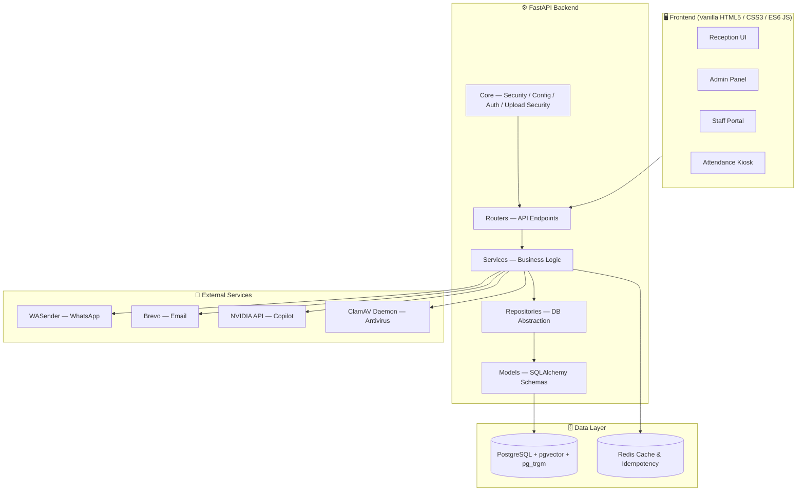
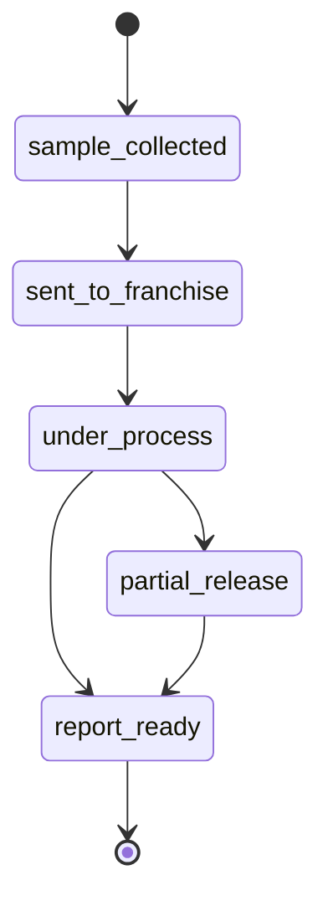

<div align="center">


# 🧪 Akriti Pathology Lab Management System
### A Next-Generation, AI-Powered, Enterprise-Grade Laboratory Information System (LIS)

<p>
  
  
  
  
</p>
<p>
  
  
  
  
</p>

**Custom-engineered for [Akriti Diagnostics Center](https://akritidc.in)**

**[🔗 Live Demo](https://akritidc.onrender.com/)**

</div>

---

## 📖 Overview

The **Akriti Pathology Lab Management System** is a premium, secure, and high-performance platform engineered end-to-end for **Akriti Diagnostics Center**. It unifies a robust **FastAPI (Python)** backend with a fast, dependency-light **Vanilla JS / HTML5** frontend into a single deployable monolith.

The user interface is powered by our proprietary **Clinical Workbench** design system, inspired by Hematoxylin & Eosin (H&E) tissue stains, offering a sterile, precise, and highly functional clinical environment for medical professionals.

Engineered for extreme reliability, 50M+ scale, and rigorous security, the system streamlines everything from patient registration and dynamic UPI billing, to AI-assisted diagnostics, WhatsApp report delivery, and biometric staff attendance — all under one roof.

---

## 📑 Table of Contents

- [Key Features](#-key-features)
- [Clinical Workbench UI](#-clinical-workbench-ui-design-system)
- [System Architecture](#️-system-architecture)
- [Report Lifecycle](#-report-lifecycle)
- [Technical Stack](#️-technical-stack)
- [Project Structure](#-project-structure)
- [Enterprise Security & Pre-Launch Audit](#-enterprise-security--pre-launch-audit)
- [Installation & Local Setup](#-installation--local-setup)
- [License](#-license)

---

## 🌟 Key Features

### 🤖 AI Copilot <sub>(Powered by NVIDIA Llama 3.1 8B)</sub>
- **Context-Aware Chatbot** — Intelligent AI assistant for answering queries, fetching live patient statistics, and resolving operational roadblocks.
- **Strict Anti-Hallucination Engine** — Hardened safeguards ensure the AI never invents patient names, financial data, or diagnostics; responds with *"Insufficient info"* if exact data is absent.
- **Role-Based Dynamic Security** — AI strictly enforces Role-Based Access Control (RBAC). Non-admin staff attempting to query revenue, staff codes, or audit logs trigger an automatic security alert block.
- **Non-Blocking Threadpool Execution** — System prompt database context generation runs asynchronously via FastAPI threadpool, keeping the event loop fluid under load.

### 🏥 Reception & Patient Management
- **Rapid Registration & Atomic ID Generation** — Registration generates calendar-year tracking codes (e.g., `PAT260001`) powered by atomic PostgreSQL sequences (`nextval`) to eliminate race conditions under concurrent load.
- **Offline-First Architecture** — Local queueing of registrations and payments when connectivity drops, auto-syncing when connection restores.
- **Zero-Fee UPI Integration** — Generates dynamic UPI QR codes tied to patient totals via direct VPA, bypassing payment gateway commissions.

### 🔬 Lab Operations & Smart Reporting
- **Master Test Catalog** — Pre-seeded with 65+ standard diagnostic tests and parameter definitions.
- **Dual-Path Report Release:**
  1. **Structured Result Entry** — Enter test parameters (e.g. Hemoglobin, WBC) to auto-render branded PDF reports with real-time abnormal result detection and reference range validation.
  2. **Manual PDF Upload** — Drag-and-drop custom or scanned lab PDFs securely into Supabase/local storage.
- **Report Security & Digital Hash Verification** — Every report generates an immutable SHA-256 digital hash verification mechanism with a public verification endpoint (`/api/v1/reports/verify/{report_id}`).

### 💬 Real-Time Notifications
- **WASender WhatsApp API Integration** — Sends welcome messages with patient IDs and PDF report links directly to patient mobile devices.
- **Brevo SMTP / Email Service** — Sends system alerts, OTP verification codes, and PDF attachments via email.

### 👤 Biometric Attendance Kiosk
- **Face Recognition Check-in** — Real-time Check-In/Check-Out station for lab staff.
- **Anti-Spoof Liveness Gating** — Validates pose and image quality before accepting attendance data.
- **High-Speed Vector Search** — Uses PostgreSQL's `pgvector` extension for instantaneous facial embedding matching.

---

## 🎨 Clinical Workbench UI (Design System)

The frontend uses a specialized **Clinical Workbench** design system tailored specifically for diagnostic laboratories:
- **H&E Color Palette**: Inspired by histology stains — Primary Deep Nuclear Blue (`#0a192f`, Hematoxylin) and Critical Eosin Rose (`#C0392B`).
- **Tabular Precision**: Clinical values, dates, and patient IDs are formatted in `IBM Plex Mono` for vertical scan alignment.
- **Sterile Opaque Surfaces**: Structured card surfaces cast subtle diffuse shadows without glassmorphism noise for maximum clarity.
- **Dark Mode Support**: Built-in dark mode togglable directly from Settings.

---

## 🏗️ System Architecture

`main.py` serves as the single entry point, hosting the FastAPI app and static frontend files cleanly:



---

## 📈 Report Lifecycle

Every patient record flows through a strict, auditable state machine:



---

## 🛠️ Technical Stack

| Layer | Technology |
|---|---|
| **Backend** | FastAPI (Python 3.10+), SQLAlchemy (Core/ORM), Uvicorn, Gunicorn |
| **Database** | PostgreSQL (`pgvector` + `pg_trgm` extensions), Redis (caching & idempotency) |
| **Migrations** | Alembic |
| **Frontend** | Vanilla HTML5, CSS3, ES6+ JavaScript — lightweight, zero virtual DOM overhead |
| **Design System** | Clinical Workbench (H&E Palette: Hematoxylin Navy & Eosin Rose), Public Sans, IBM Plex Mono |
| **Integrations** | WASender API (WhatsApp), Brevo (Email), NVIDIA API (AI Copilot), ClamAV |
| **Deployment** | Docker & Docker Compose |

---

## 📂 Project Structure

```text
Akriti/
├── backend/
│   └── app/
│       ├── routers/         # FastAPI endpoint definitions (Auth, Patient, Report, Copilot, Finance, Staff, Security)
│       ├── services/        # Business logic & integrations (WhatsApp, PDFs, AI, Face Matching, Idempotency)
│       ├── repositories/    # Database repository layer
│       ├── models/          # SQLAlchemy database models
│       ├── schemas/         # Pydantic request/response schemas
│       └── core/            # Core security, database pooling, configuration, upload validation
├── frontend/
│   ├── admin/               # Admin panel pages (Dashboard, Patients, Staff, Tests, Revenue, Expenses, Audit Log, Sessions)
│   ├── staff/               # Staff portal pages (Add Patient, Patient List, Settings)
│   ├── assets/              # Design system CSS tokens, components, and layout stylesheets
│   └── attendance-kiosk.html# Biometric check-in/out kiosk
├── alembic/                 # Database migration scripts
├── scripts/                 # Utility & database backup scripts
├── docker-compose.yml        # Docker production stack
├── Dockerfile               # Multi-stage Docker build configuration
├── main.py                  # Single entry point
└── requirements.txt         # Pinned python dependencies
```

---

## 🔒 Enterprise Security & Pre-Launch Audit

The system has undergone a formal **Third-Party Pre-Launch Security & QA Audit** and is certified **READY TO LAUNCH (PASS)**:

- **Argon2id Password Hashing + Pepper** — Credentials hashed using Argon2id combined with a server-side HMAC password pepper. Includes seamless auto-rehash migration from legacy bcrypt hashes.
- **OWASP Top 10 (2021) Compliance** — Full compliance across Broken Access Control, Cryptographic Failures, Injection, Insecure Design, Security Misconfiguration, and SSRF.
- **Multi-Layer Upload Security** — Uploads validated via file size limits, extension whitelisting, magic byte validation, Pillow image verification, PDF script tag scanning (`<script>`, `<?php`), and optional ClamAV antivirus socket scanning.
- **Cryptographic Audit Log Chain** — System activities recorded in `audit_logs` using HMAC-SHA256 hash-chaining (`record_hash`) linking each log entry to the previous entry, verifiable via `/api/v1/audit-logs/verify-chain`.
- **50M Record Scale & Concurrency Ready** — Partial B-tree indexes, PostgreSQL trigram GIN indexes (`pg_trgm`), statement/lock timeouts, and sequence-backed code generation (`nextval`) ensure optimal performance under 150+ concurrent staff sessions.
- **Financial Precision** — Fixed-point `Numeric(10,2)` schema representations eliminate IEEE 754 floating-point rounding errors across all monetary transactions.

---

## 🚀 Installation & Local Setup

### 1. Prerequisites
- Python 3.10+
- PostgreSQL 14+ (with `pgvector` & `pg_trgm` extensions)
- Redis Server *(optional — in-memory fallback enabled)*

### 2. Local Installation

```bash
# 1. Clone the repository
git clone https://github.com/Kunal9608/Akriti.git
cd Akriti

# 2. Create virtual environment
python -m venv .venv
# Windows: .venv\Scripts\activate
# Linux/Mac: source .venv/bin/activate

# 3. Install dependencies
pip install -r requirements.txt

# 4. Environment setup
cp .env.example .env
# Edit .env with your PostgreSQL credentials, JWT keys, and NVIDIA_API_KEY.

# 5. Run the application
python main.py
```

### 3. 🐋 Docker Deployment

Deploy the entire production stack using Docker Compose:

```bash
docker compose up --build -d
```

| Component | Access URL |
|---|---|
| Web Application | `http://localhost:8000` |
| Interactive API Docs | `http://localhost:8000/docs` |

---

## 📜 License

This software is strictly **proprietary** and custom-engineered for **Akriti Diagnostics Center**. Unauthorized distribution, reproduction, deployment, or reverse engineering is strictly prohibited.

---

<div align="center">

### 👤 Author

**Kunal** — [@Kunal9608](https://github.com/Kunal9608)

<sub>Engineered for Akriti Diagnostics Center 🩺</sub>

</div>
