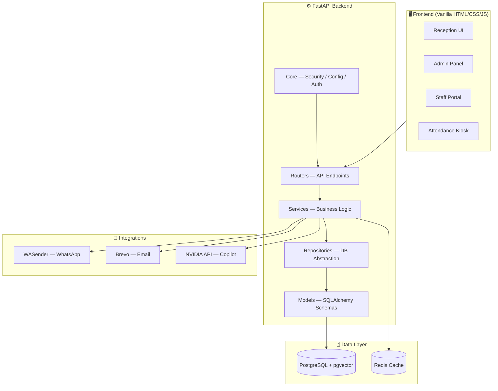
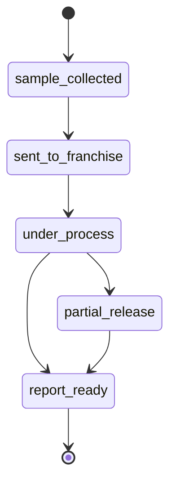

<div align="center">


# 🧪 Akriti Pathology Lab Management System
### A Next-Generation, AI-Powered, Highly Secure Laboratory Information System (LIS)

<p>
  
  
  
  
</p>
<p>
  
  
  
</p>

**Custom-engineered for [Akriti Diagnostics Center](https://akritidc.in)**

**[🔗 Live Demo](https://akritidc.onrender.com/)**

</div>

---

## 📖 Overview

The **Akriti Pathology Lab Management System** is a premium, secure, and modern platform built end-to-end for **Akriti Diagnostics Center**. It unifies a robust **FastAPI (Python)** backend with a fast, dependency-light **Vanilla JS / HTML5** frontend into a single deployable monolith.

Engineered for speed, offline-resilience, and maximum security, the system streamlines everything from patient registration and dynamic UPI billing, to AI-assisted diagnostics, WhatsApp report delivery, and biometric staff attendance — all under one roof.

---

## 📑 Table of Contents

- [Key Features](#-key-features)
- [System Architecture](#️-system-architecture)
- [Report Lifecycle](#-report-lifecycle)
- [Technical Stack](#️-technical-stack)
- [Project Structure](#-project-structure)
- [Enterprise-Grade Security](#-enterprise-grade-security)
- [Installation & Local Setup](#-installation--local-setup)
- [License](#-license)

---

## 🌟 Key Features

### 🤖 AI Copilot <sub>(Powered by Llama 3.1 8B via NVIDIA)</sub>
- **Context-Aware Chatbot** — Intelligent AI assistant for answering queries, fetching live patient statistics, and resolving operational roadblocks.
- **Strict Anti-Hallucination Engine** — Hardened safeguards ensure the AI never invents patient names, financial data, or diagnostics; responds with *"Insufficient info"* if exact data is absent.
- **Smart Rate Limiting** — Dynamic streaming rate limits protect API quotas (Admin: 7 msgs/min, Staff: 3 msgs/min).

### 🏥 Reception & Patient Management
- **Rapid Registration & Smart Billing** — Lightning-fast intake forms generating calendar-year based tracking codes (e.g. `PAT260001`), with totals strictly computed server-side to prevent tampering.
- **Offline-First Architecture** — Seamless local queueing of registrations and payments when connectivity drops, auto-syncing the moment the connection is restored.
- **Zero-Fee UPI Integration** — Instantly generates dynamic UPI QR codes tied to patient totals via direct VPA, bypassing costly payment-gateway commissions.

### 🔬 Lab Operations & Smart Reporting
- **Master Test Catalog** — Pre-seeded with 65+ standard diagnostic tests.
- **Dual-Path Report Release:**
  1. **Structured Result Entry** — Enter parameters (e.g. Hemoglobin, WBC) to auto-render branded PDF reports.
  2. **Manual PDF Upload** — Drag-and-drop custom or scanned lab PDFs securely into Supabase/local storage.
- **Report Security & Verification** — Every generated PDF carries an immutable SHA-256 hash validation mechanism plus a modification log.

### 💬 Real-Time WhatsApp Alerts
Integrated with the **WASender API** (Cloudflare-bypass enabled) for automated communication:
- **Welcome Alerts** — Sends the unique Patient ID immediately on registration.
- **Status Tracking** — Proactive notifications as a sample's status progresses.
- **Direct Report Delivery** — Finalized PDFs delivered straight to the patient's WhatsApp via secure, temporary download URLs.

### 👤 Biometric Attendance Kiosk
- **Face Recognition Check-in** — Real-time Check-In/Check-Out station for lab staff.
- **Anti-Spoof Liveness Gating** — Validates pose and image quality before accepting attendance data.
- **High-Speed Vector Storage** — Uses PostgreSQL's `pgvector` extension for instantaneous facial-recognition matching across the staff database.

---

## 🏗️ System Architecture

`main.py` is the single entry point — it boots the FastAPI backend and serves the static frontend, all in one deployable unit.



---

## 📈 Report Lifecycle

Every sample flows through a strict, auditable state machine:



---

## 🛠️ Technical Stack

| Layer | Technology |
|---|---|
| **Backend** | FastAPI (Python 3.10+), SQLAlchemy (Core/ORM), Uvicorn, Gunicorn |
| **Database** | PostgreSQL (`pgvector` + `pg_trgm` extensions), Redis (caching & idempotency) |
| **Migrations** | Alembic |
| **Frontend** | Vanilla HTML5, CSS3, ES6+ JavaScript — no heavy VDOM frameworks, built for raw speed |
| **Design System** | Cream Vanilla (`#EFE6DD`) + Cherry Cola (`#9A0002`) palette, Outfit/Inter typography, custom skeleton loaders |
| **Integrations** | WASender API (WhatsApp), Brevo (Transactional mail), OpenAI SDK for NVIDIA API (AI Copilot) |
| **Deployment** | Docker & Docker Compose |

---

## 📂 Project Structure

```
Akriti/
├── backend/
│   └── app/
│       ├── routers/         # FastAPI endpoint definitions
│       ├── services/        # Business logic + integrations (WhatsApp, PDFs, AI)
│       ├── repositories/    # Database abstraction layer (Repo pattern)
│       ├── models/          # SQLAlchemy database schemas
│       ├── schemas/         # Pydantic request/response models
│       └── core/            # Security, config, auth, DB connections
├── frontend/
│   ├── admin/                # Admin panel UI
│   ├── staff/                 # Staff portal UI
│   └── attendance-kiosk.html  # Biometric check-in/out kiosk
├── alembic/                  # Database migration scripts
├── scripts/                  # Utility scripts (e.g. generate_secrets.py)
├── docker-compose.yml         # FastAPI + Postgres + Redis stack
├── Dockerfile
├── main.py                    # Single entry point — backend + static frontend
├── requirements.txt
└── brain.md                   # Project knowledge base for future dev/AI onboarding
```

---

## 🔒 Enterprise-Grade Security

Security is deeply woven into the fabric of the Akriti PathLab System.

- **Hardened Password Hashing** — `bcrypt` hashing with automatic salting plus a server-side HMAC **Password Pepper**, with a built-in migration trigger for upgrading legacy hashes.
- **Strong Password Policies** — Enforced complexity rules on every credential, backed by dedicated test coverage.
- **JWT-Based Authentication** — Stateless auth managed centrally through `backend/app/core/`.
- **Multi-Device Session Revocation** — Active session tracking automatically terminates older tokens when a new device logs in.
- **IDOR Prevention** — Strict `check_patient_access` checks ensure staff can only view/manage patients they registered, blocking lateral data access.
- **DDoS & Brute-Force Protection** — In-memory token-bucket + `slowapi` rate limiting (e.g. 5 attempts/min on login endpoints).
- **Secure Deployment Tooling** — Bundled `generate_secrets.py` CLI to provision cryptographically secure JWT keys and Peppers for production.

---

## 🚀 Installation & Local Setup

### 1. Prerequisites
- Python 3.10+
- PostgreSQL 14+ (with the `pgvector` extension installed)
- Redis Server *(optional — built-in fallback enabled)*

### 2. Standard Installation

```bash
# 1. Clone the repository
git clone https://github.com/Kunal9608/Akriti.git
cd Akriti

# 2. Set up a virtual environment
python -m venv .venv
# Windows: .venv\Scripts\activate
# Linux/Mac: source .venv/bin/activate

# 3. Install dependencies
pip install -r requirements.txt

# 4. Configure environment
cp .env.example .env
# Fill in DB credentials, Supabase keys, and WhatsApp tokens

# 5. Generate secure secrets
python backend/scripts/generate_secrets.py
# Copy the output keys into your .env file

# 6. Run the server
python main.py
```

### 3. 🐋 Docker Deployment <sub>(Recommended)</sub>

Run the entire stack — FastAPI, Postgres, and Redis — with a single command:

```bash
docker compose up --build -d
```

| Service | URL |
|---|---|
| Web App | `http://localhost:8000` |
| Swagger API Docs | `http://localhost:8000/docs` |

---

## 📜 License

This software is strictly **proprietary** and custom-built for **Akriti Diagnostics Center**. Unauthorized distribution, reproduction, deployment, or reverse engineering is explicitly prohibited.

---

<div align="center">

### 👤 Author

**Kunal** — [@Kunal9608](https://github.com/Kunal9608)

<sub>Engineered for Akriti Diagnostics Center 🩺</sub>

</div>
